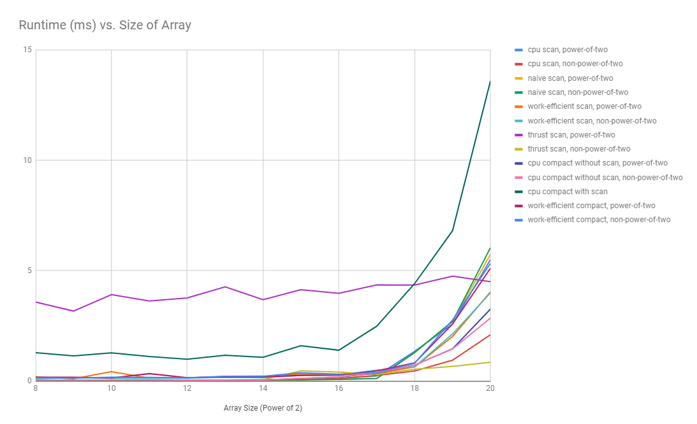

CUDA Stream Compaction
======================

**University of Pennsylvania, CIS 565: GPU Programming and Architecture, Project 2**

* Emily Vo
  * [LinkedIn](linkedin.com/in/emilyvo), [personal website](emilyhvo.com)
* Tested on: Windows 10, i7-7700HQ @ 2.8GHz 16GB, GTX 1060 6GB (Personal Computer)
Updated the CMakeLists.txt to sm_61.

### PERFORMANCE ANALYSIS

* Compare all of these GPU Scan implementations (Naive, Work-Efficient, and Thrust) to the serial CPU version of Scan. Plot a graph of the comparison (with array size on the independent axis).


* To guess at what might be happening inside the Thrust implementation (e.g. allocation, memory copy), take a look at the Nsight timeline for its execution. Your analysis here doesn't have to be detailed, since you aren't even looking at the code for the implementation. Write a brief explanation of the phenomena you see here.

The first thrust run (power of 2) is much slower than the second (non power of 2), and much slower than all implementation at all array sizes except those greater than 2^20. This might be due to the first instance of invoking thrust requiring a lot of extra time to set up the library and any utility classes.

The CPU implementation is surprisingly fast compared to the parallel implementations. This is likely due to the lack of overhead in kernel invocations, and speed of the cache, as the CPU processes the array sequentially.

The work efficient implementation is slower than the naive solution. This is surprising, as the naive implementation does less work, but it appears that once again, like the CPU implementation, the fewer kernal invocations, as well as the lack of copying memory between the host and device, makes the naive solution faster. As the arrays get larger, I would expect this amount of overhead to stay constant, and so I would expect the work efficient implementation to eventually be faster.

When we look at the curves, we see that the CPU implementation grows linearly as the array size grows (the line looks exponential as the x axis increases exponentially). This is expected, as the number of operations is linear. The other curves grow much slower. The Thrust implementation stays almost constant, indicating that the majority of the work it does is not actually related to computing the scan.

* Paste the output of the test program into a triple-backtick block in your README.
```
****************
** SCAN TESTS **
****************
    [   0   1   2   3   4   5   6   0 ]
==== cpu scan, power-of-two ====
   elapsed time: 0.000365ms    (std::chrono Measured)
    [   0   0   1   3   6  10  15  21 ]
==== cpu scan, non-power-of-two ====
   elapsed time: 0ms    (std::chrono Measured)
    [   0   0   1   3   6 ]
    passed
==== naive scan, power-of-two ====
   elapsed time: 0.014464ms    (CUDA Measured)
    passed
==== naive scan, non-power-of-two ====
   elapsed time: 0.012608ms    (CUDA Measured)
    passed
==== work-efficient scan, power-of-two ====
   elapsed time: 0.116896ms    (CUDA Measured)
    [   0   0   1   3   6  10  15  21 ]
    passed
==== work-efficient scan, non-power-of-two ====
   elapsed time: 0.08192ms    (CUDA Measured)
    passed
==== thrust scan, power-of-two ====
   elapsed time: 4.4583ms    (CUDA Measured)
    passed
==== thrust scan, non-power-of-two ====
   elapsed time: 0.014304ms    (CUDA Measured)
    passed

*****************************
** STREAM COMPACTION TESTS **
*****************************
    [   0   3   2   1   3   2   0   0 ]
==== cpu compact without scan, power-of-two ====
   elapsed time: 0ms    (std::chrono Measured)
    [   3   2   1   3   2 ]
    passed
==== cpu compact without scan, non-power-of-two ====
   elapsed time: 0.000365ms    (std::chrono Measured)
    [   3   2   1   3 ]
    passed
==== cpu compact with scan ====
   elapsed time: 2.09687ms    (std::chrono Measured)
    [   3   2   1   3   2 ]
    passed
==== work-efficient compact, power-of-two ====
   elapsed time: 0.088352ms    (CUDA Measured)
    [   3   2   1   3   2 ]
    passed
==== work-efficient compact, non-power-of-two ====
   elapsed time: 0.081344ms    (CUDA Measured)
    [   3   2   1   3 ]
    passed
```
